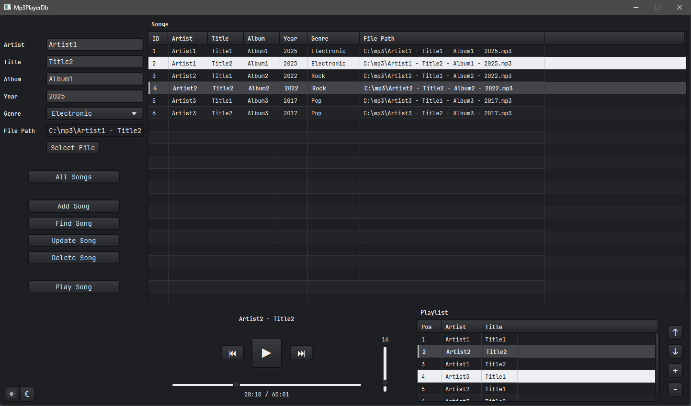
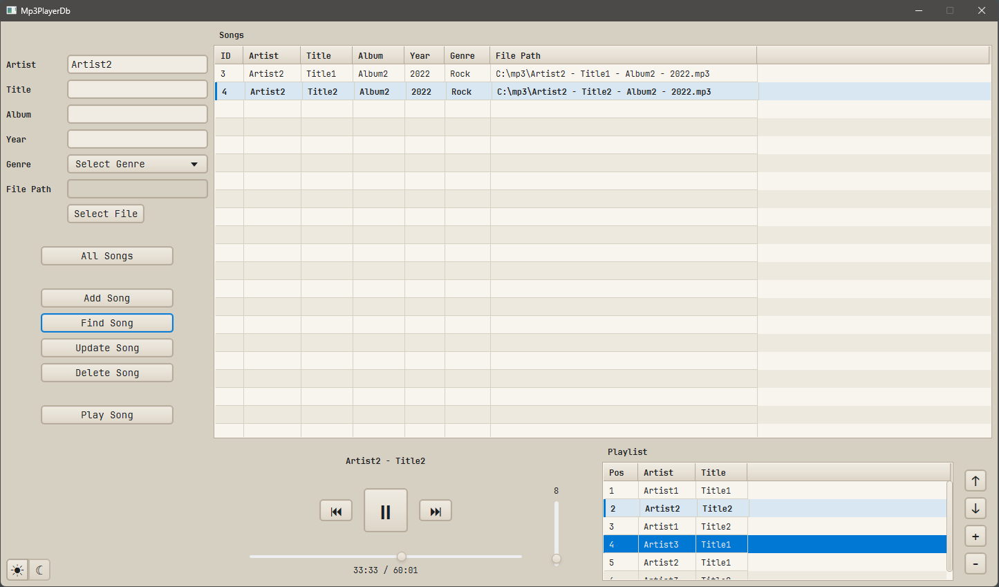

# Mp3PlayerDb

A desktop music player and song database built with JavaFX and SQLite.

Mp3PlayerDb combines local MP3 playback with song management and a customizable playlist.

Song information can be entered manually or imported from ID3 metadata.

[**Download for Windows (v1.0-rc1)**](https://github.com/devake86/Mp3PlayerDb/releases/download/v1.0-rc1/Mp3PlayerDb_v1.0-rc1.zip)

---

## Version

**1.0-rc1**

Initial release candidate featuring song management, MP3 playback, ID3 metadata import, playlist management and light/dark themes.

---

## Screenshots

<details open>
<summary>Dark Theme overview</summary>



*Overview in Dark Theme showing the song database, input fields, media player and persistent playlist. (v1.0-rc1).*

</details>

<details>
<summary>Light Theme with search and playback</summary>



*Light Theme showing filtered search results, active MP3 playback and the distinction between the selected and currently loaded song. (v1.0-rc1).*

</details>

---

## Feature Overview

- Add, find, update and delete songs
- Store song information in a local SQLite database
- Play local MP3 files with JavaFX Media
- Import ID3 metadata from MP3 files
- Select MP3 files through a file chooser or drag and drop
- Create and reorder a persistent playlist
- Automatically continue with the next playlist entry
- Seek through the current song using an interactive timeline
- Adjust and persist the playback volume
- Highlight the currently loaded song
- Switch between light and dark themes
- Restore the previous playlist selection
- Automatically resize table columns to their content

---

## Notes

- Mp3PlayerDb references local MP3 files and does not copy them.
- Moving or deleting an MP3 file makes its stored file path invalid.
- ID3 metadata is imported when matching values are available.
- Unsupported metadata genres must be selected manually.

---

## Technologies

- Java 25
- JavaFX 25
- FXML
- CSS
- SQLite
- JDBC
- mp3agic
- Gradle
- jpackage

---

## Requirements

### Packaged application

- Windows 10 or newer
- No separate Java installation required

### Running from source

- JDK 25
- Gradle is not required because the Gradle Wrapper is included

---

## Running from Source

Clone the repository and run the application with the Gradle Wrapper:

```powershell
.\gradlew run
```

---

## Data Storage

The application creates its SQLite database locally when first started:

```text
db/mp3playerdb.db
```

The database and personal MP3 files are not included in this repository.

---

## License

This project was created as a personal learning and reference project.

For licensing information, see the LICENSE file in this repository.
